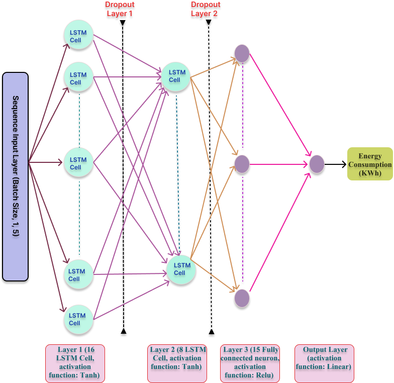

# 🔋 EV Charging Station Energy Usage Prediction using LSTM

This project predicts the energy consumption (`Energy (kWh)`) at electric vehicle (EV) charging stations using a deep learning model based on LSTM (Long Short-Term Memory) networks. The dataset contains real-world EV charging station logs from the City of Palo Alto, California.

---

## 🧱 Proposed LSTM Architecture


## 📌 Project Overview

- ✅ **Goal**: Predict the `Energy (kWh)` used during a charging session based on features like session duration, charging time, fee, and environmental savings.
- 🧠 **Model**: LSTM-based regression model built using TensorFlow/Keras.
- 📈 **Performance**:
  - **MAE**: `0.37 kWh`
  - **RMSE**: `0.57 kWh`
  - **R² Score**: `0.99`
---
## 🧪 Unit Testing

Unit tests are written using the `pytest` framework. They test utility functions like `convert_to_seconds()` from `utils.py`.

Example tested:

```python
from utils import convert_to_seconds

from utils import convert_to_seconds

def test_convert_to_seconds():
    assert convert_to_seconds("01:30:00") == 5400
    assert convert_to_seconds("00:00:10") == 10
    assert convert_to_seconds(None) is None
    assert convert_to_seconds("00:00:00") == 0


## 📂 Dataset

- **File**: `EVChargingStationUsage.csv`
- **Size**: 33 columns × 259,415 rows


### Selected Features
- `Total Duration (hh:mm:ss)`
- `Charging Time (hh:mm:ss)`
- `Fee`
- `Gasoline Savings (gallons)`
- `GHG Savings (kg)`

### Target Variable
- `Energy (kWh)`

---

---

## ✅ Run the Tests

To run unit tests using `pytest`:

```bash
pytest test_utils.py

## 🧱 Exception Handling
Included in the utility function convert_to_seconds():

python
Copy code
def convert_to_seconds(time_str):
    try:
        if isinstance(time_str, str):
            h, m, s = map(int, time_str.split(':'))
            return h * 3600 + m * 60 + s
    except ValueError as e:
        print(f"Invalid time format: {e}")
    return None

## 🛠️ Tools & Libraries
Languages: Python

- Core Libraries: pandas, numpy, matplotlib, scikit-learn, TensorFlow/Keras

- Testing: pytest

- Utilities:  try/except blocks for robustness

 How to Run
Clone the repository and install the required dependencies.

Open Spatiotemporal_forecasting.ipynb in Jupyter or Google Colab.

Run all cells in order — this will load the data, preprocess it, train the LSTM model, evaluate predictions, and generate plots.

To test utility functions, run the following in the terminal:
```bash
pytest test_utils.py

